# Unsupervised Learning Approach applied to a customer Churn dataset

## 

## **Approach 1: Customer Segmentation Based on Transaction Behavior**:

## **Approach 2: Segmentation Based on Registration and Channel**

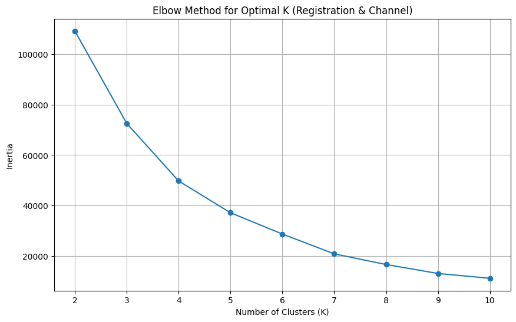

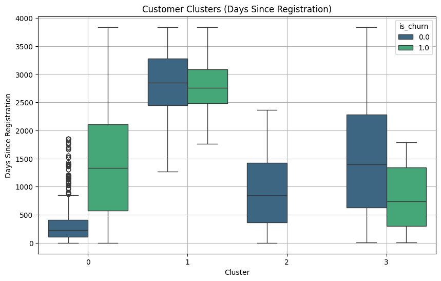

## **Approach 4: Anomaly Detection using Isolation Forest**

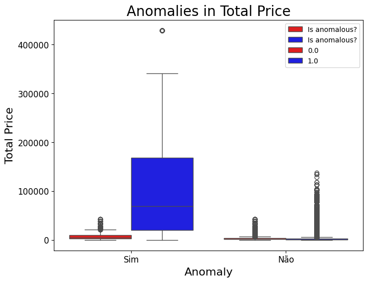

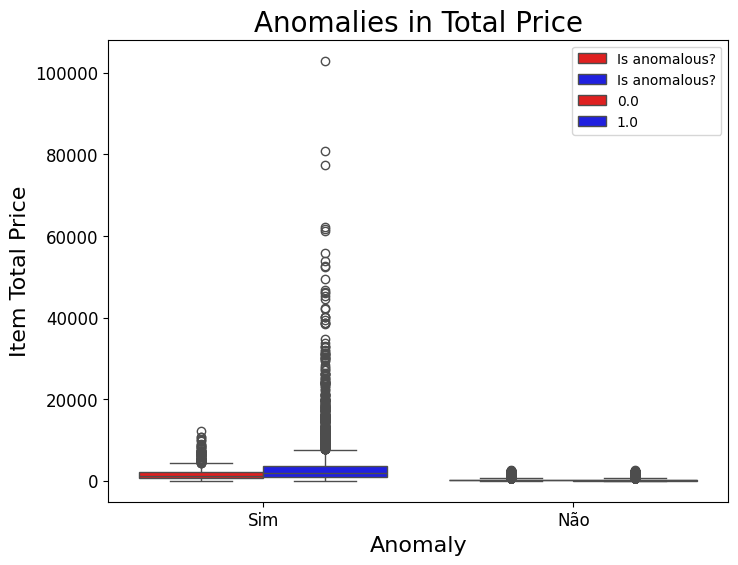

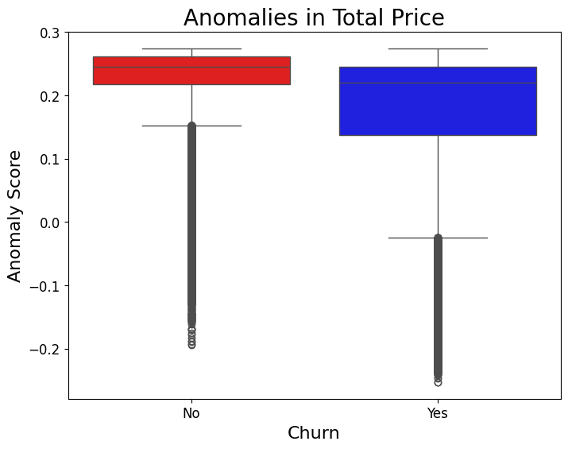

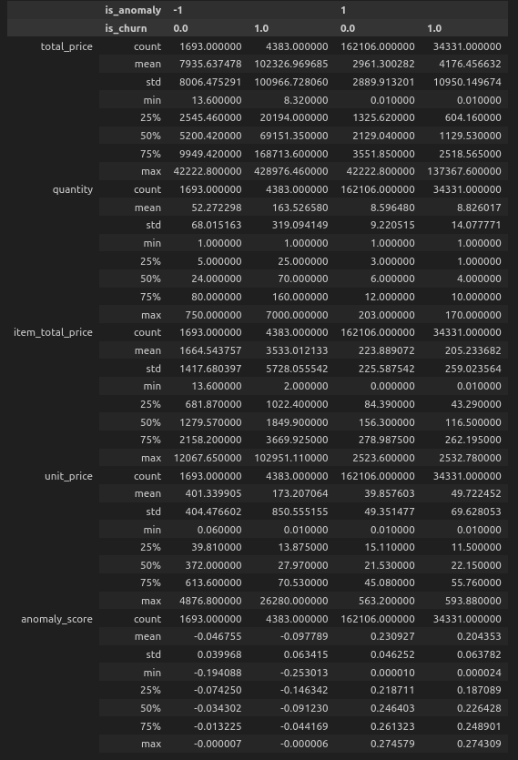

## **Approach 5: Hierarchical Clustering**

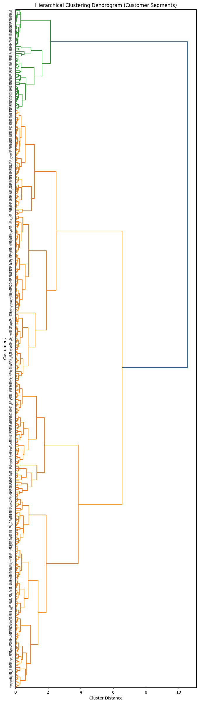

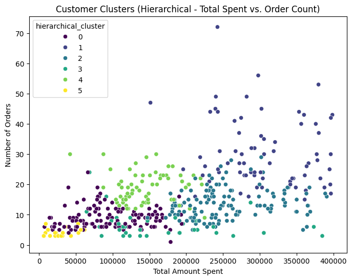

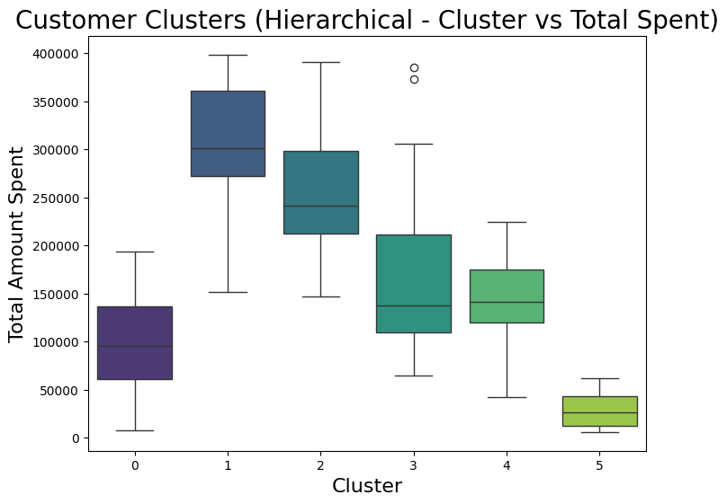

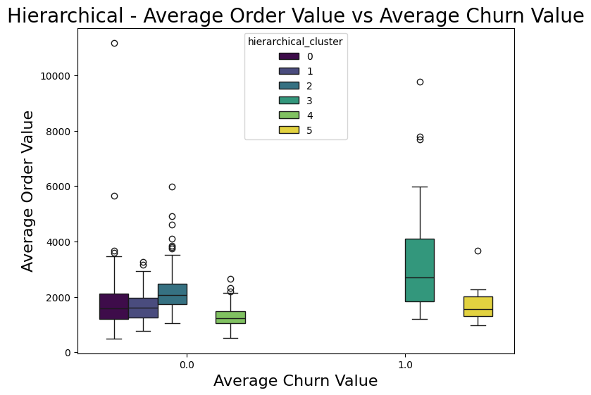

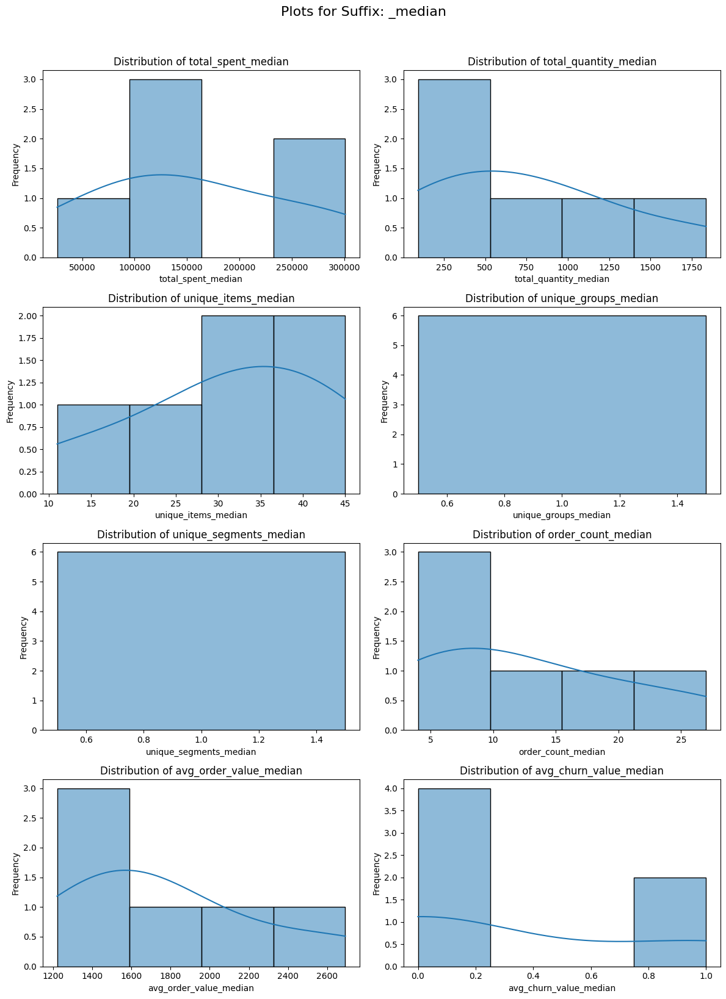

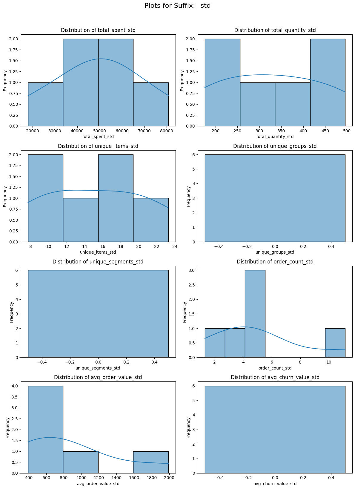

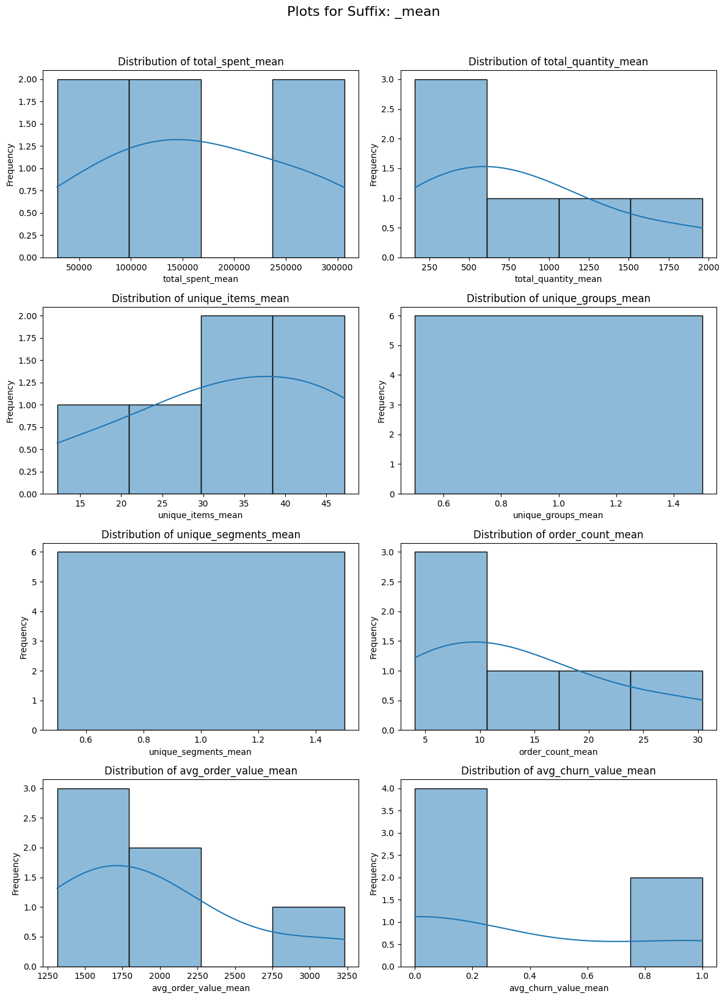

## **Approach 6: PCA**
