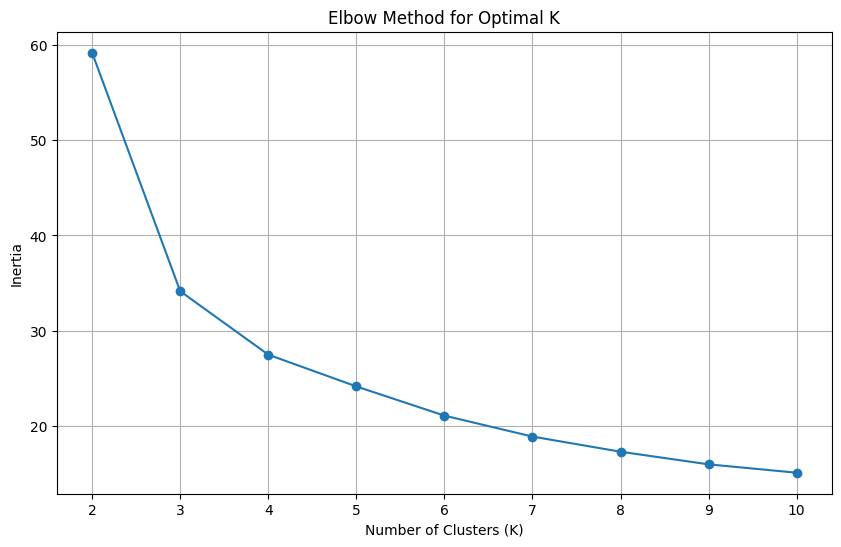
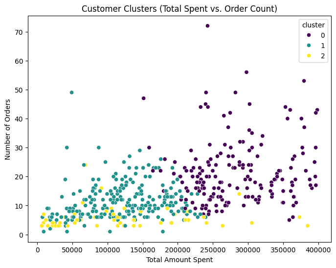
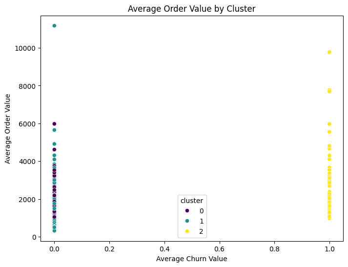
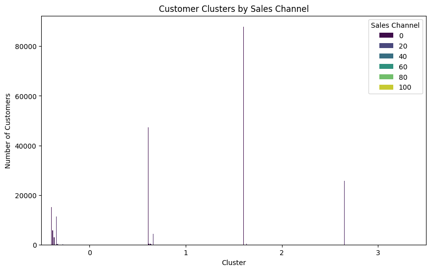
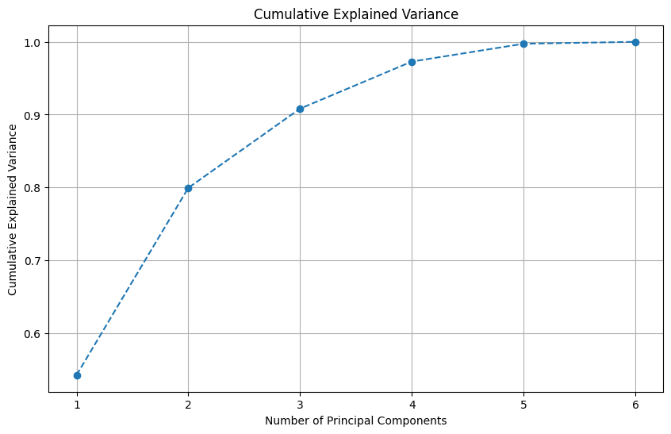
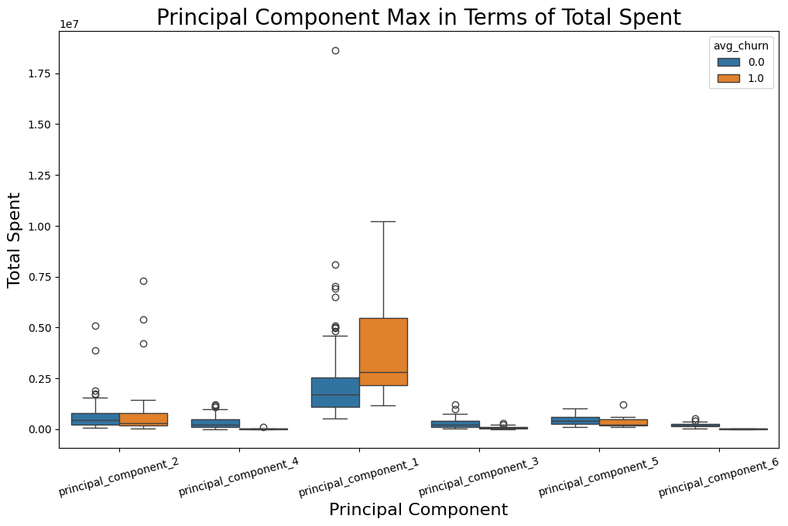
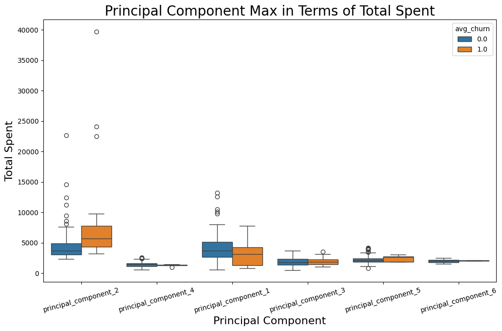
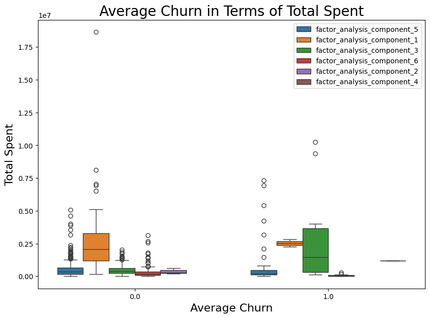
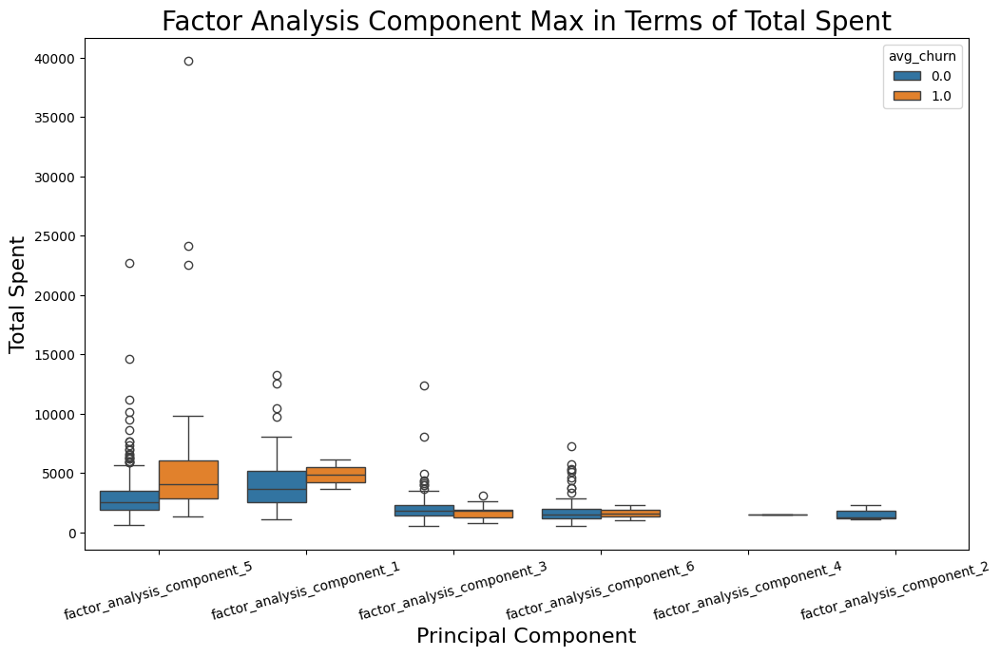

# Unsupervised Learning Approach applied to a customer Churn dataset

## **Data Dictionary:**

1. **customer_code**: Unique identifier for each customer.

2. **branch_id**: Identifier for the branch associated with the transaction.

3. **sales_channel**: Channel through which the sale was made (e.g., online, in-store, etc.).

4. **seller_code**: Identifier for the seller involved in the transaction.

5. **register_date**: Date when the customer registered.

6. **total_price**: Total price of the transaction.

7. **order_id**: Identifier for the order associated with the transaction.

8. **quantity**: Number of items purchased in the transaction.

9. **item_code**: Identifier for the item purchased.

10. **item_total_price**: Total price of the item in the transaction.

11. **unit_price**: Price per unit of the item.

12. **group_code**: Code indicating the group/category to which the item belongs.

13. **segment_code**: Code indicating the segment to which the item belongs.

14. **is_churn (Target)**: Binary variable indicating whether the customer churned (1) or not (0).

## Possible Unsupervised Learning Approaches

1. **Customer Segmentation Based on Transaction Behavior**:

- Features to Use: total_price, quantity, item_code (number of unique items), group_code (most frequent groups), segment_code (most frequent segments), average item_total_price per transaction.
- Technique: K-Means clustering would be a good starting point.
- Use Case:
- Identify spending habits: Segment customers based on their average transaction value and the total amount they spend. This can help differentiate high-value customers from occasional buyers.
Understand purchase diversity: Group customers by the variety of items, groups, or segments they purchase. Some segments might be loyal to specific product categories, while others explore a wider range.
- Quantity-based segmentation: Identify customers who tend to buy in bulk versus those who purchase single items. This could inform inventory management and targeted offers.

2. **Segmentation Based on Registration and Channel**:

- Features to Use: register_date (recency of registration, time since registration), sales_channel.
- Technique: K-Means or even exploring descriptive statistics for groups defined by sales_channel.
- Use Case:
- New vs. Established Customers: Segment customers based on how long they've been registered. Newer customers might have different needs and churn patterns than long-term ones.
- Channel-Specific Customer Profiles: Understand if customers acquired through different sales_channel exhibit distinct purchasing behaviors in terms of price, quantity, or item preferences. This can inform channel-specific marketing strategies.

3. **Item Grouping and Recommendation Exploration**:

- Features to Use: item_code, group_code, segment_code.
- Technique: Association rule mining (like Apriori) or clustering items based on co-occurrence in transactions.
- Use Case:
- Discover frequently bought together items: Identify items that are often purchased in the same order. This can be used for cross-selling recommendations (e.g., "Customers who bought X also bought Y").
- Group similar items: Cluster item_code based on their group_code and segment_code to identify natural groupings. This can help in catalog organization and understanding product relationships.

4. **Identifying Potential Anomalies in Transactions**:

- Features to Use: total_price, quantity, item_total_price, unit_price.
- Technique: Isolation Forest or DBSCAN.
- Use Case:
- Detect unusual order values: Identify transactions with exceptionally high or low total_price or quantity compared to the typical order. This could flag potential errors or fraudulent activities.
- Unusual unit prices: Spot transactions where the unit_price deviates significantly from the norm for a particular item_code.

5. **Exploring Seller or Branch Performance Patterns**:

- Features to Use: seller_code, branch_id, aggregate features like average total_price per transaction, average quantity per transaction associated with each seller or branch.
- Technique: Clustering based on these aggregated features.
- Use Case:
- Identify high-performing vs. low-performing sellers/branches: Group sellers or branches based on their average sales value or transaction volume.
- Understand regional or seller-specific purchasing patterns: See if certain branches or sellers tend to have customers with different average order sizes or item preferences.

## Important Considerations:

- Data Aggregation: For some use cases (like seller/branch performance), you'll need to aggregate the transaction-level data to the seller or branch level.
- Feature Scaling: Remember to scale numerical features before applying distance-based algorithms like K-Means to prevent features with larger ranges from dominating the clustering process.
- Categorical Feature Handling: For categorical features like sales_channel, group_code, and segment_code, you might need to use appropriate distance metrics for clustering or encode them (e.g., one-hot encoding) depending on the algorithm.
- Interpretation is Key: The most crucial step is to interpret the resulting clusters or anomalies in the context of your business. What do these groupings mean? What are the characteristics of the anomalous transactions?

## **Approach 1: Customer Segmentation Based on Transaction Behavior**:

- **Features to Use**: total_price, quantity, item_code (number of unique items), group_code (most frequent groups), segment_code (most frequent segments), average item_total_price per transaction.
- **Technique**: K-Means clustering would be a good starting point.
- Use Case:
- **Identify spending habits**: Segment customers based on their average transaction value and the total amount they spend. This can help differentiate high-value customers from occasional buyers.
- **Understand purchase diversity**: Group customers by the variety of items, groups, or segments they purchase. Some segments might be loyal to specific product categories, while others explore a wider range.
- **Quantity-based segmentation**: Identify customers who tend to buy in bulk versus those who purchase single items. This could inform inventory management and targeted offers.

The image below shows the *elbow method* from K-Means applied to obtain insights into the suitable number of clusters for unsupervised learning. We'll use simply 3 clusters.

The figure below shows the the number of orders by total amount spent for each cluster, from which one can notice that cluster 0 tends to have a higher average value of number of orders and total amount spent, followed by clusters 1 and 2, respectively.

Now, the figure below shows the average churn value for each cluster, showing that cluster 0 and 1 are related to non-churn events, while cluster 2 is related to churn-events of customers.

## **Approach 2: Segmentation Based on Registration and Channel**

- **Features to Use**: register_date (recency of registration, time since registration), sales_channel.
- Technique: **K-Means** or even exploring descriptive statistics for groups defined by sales_channel.
- Use Case:
- New vs. Established Customers: Segment customers based on how long they've been registered. Newer customers might have different needs and churn patterns than long-term ones.
- Channel-Specific Customer Profiles: Understand if customers acquired through different sales_channel exhibit distinct purchasing behaviors in terms of price, quantity, or item preferences. This can inform channel-specific marketing strategies.

The figure below shows the elbow method applied to get insights into the best number of clusters for unsupervised learning for segmentation based on Registration and Channel. We'll use 4 clusters so on.

The next figure shows the days since registration for each cluster in terms of churn and non-churn events, from which one can notice that cluster 0 is related to churning events possessing clients with a higher median of days since registration, while cluster 3 is related to non-churning events possessing clients with a higher median of days since registration.

Now, the next figure shows the results of clusterization for each cluster segmented by sales channel. 

## **Approach 4: Anomaly Detection using Isolation Forest**

### **Isolation Forest**

- **Feature Selection**: Choose the numerical features relevant for identifying unusual transaction values: **total_price, quantity, item_total_price, and unit_price.**
- **Handle Missing Values**: Drop rows with missing values in the selected features.
- **Scale Features**: Use StandardScaler/MinMaxScaler to standardize the features. This is important because Isolation Forest is sensitive to the scale of the features.

- **Apply Isolation Forest**:

1. **Initialize the IsolationForest model**;
2. **Contamination**: This parameter estimates the proportion of outliers in the dataset;
3. **Random_state**: Ensures reproducibility of the results;
4. **Fit the model** to the scaled data;
5. **Get Anomaly Scores and Predictions**:
- **decision_function()**: Returns the anomaly score for each data point. Negative scores indicate anomalies;
6. **predict()**: Returns -1 for outliers and 1 for inliers;
7. **Add Results to DataFrame**: Add the anomaly scores and predictions as new columns to your df_anomaly DataFrame;
8. Analyze Anomalies:
- Print the counts of inliers and outliers.
- Display the first few identified anomalies.
- **Visualize Anomalies**: Create scatter plots for pairs of the chosen features, highlighting the identified anomalies in a different color. This helps visualize where the unusual transactions lie in the data space.

#### How these approaches help identify potential anomalies:

- **Isolation Forest: Works by isolating instances that are "rare" and thus easier to separate from the rest of the data.** It's effective for detecting global outliers.

The next figure shows that anomalies in total price are strongly related to churning events.

The next figure shows that anomalies in item total price are strongly related to churning events.

The next figure shows that anomalies in total price are strongly related to higher anomaly scores obtained from Isolation Forest technique.

The next figure shows the descriptive statistics of churn and non-churn events, as well as anomaly and normal events in order to get a better overall understanding of the Isolation Forest modeling.

## **Approach 5: Hierarchical Clustering**

### Hierarchical clustering is a versatile unsupervised learning technique that can definitely be applied to gain insights into churn problems, even without directly predicting the "is_churn" label. 

#### **Use Cases for Hierarchical Clustering in a Churn Problem**:

##### Customer Segmentation Based on Similarity:

- **Features to Use**: use the same sets of features for K-Means segmentation (transaction behavior, registration/channel information, etc.).
- **How it works**: Hierarchical clustering builds a hierarchy of clusters, either by starting with each data point as its own cluster and iteratively merging the closest clusters (agglomerative) or by starting with one big cluster and recursively splitting it (divisive).

##### Potential Insights:

- **Discover natural groupings**: Hierarchical clustering doesn't require you to pre-specify the number of clusters. **The dendrogram it produces can help you visualize the relationships between data points and identify natural groupings at different levels of granularity.**
- **Understand cluster relationships**: The dendrogram shows which clusters are more similar to each other, providing a richer understanding of the customer segments and their relationships.
- **Identify potential churn-prone segments**: **After forming clusters, you can analyze the churn rate within each cluster** (by merging the cluster labels with "is_churn" column). This can reveal if certain segments, defined by their transaction history or registration details, have a higher propensity to churn.

The next figure shows a dendogram in this data, from which 6 clusters have been selected.

The figure below shows a scatter plot number of orders by total amount spent for each of the six clusters.

The next figure shows a boxplot of the total amount spent by cluster, from which one can notice that clusters 1 and 2 are more related to higher values of total amount spent, while clusters 0 and 5 are more related to a lesser total amount spent.

The figure below shows a box plot of Average Order Value by average churn, from which one can notice that clusters 3 and 5 are related to churning events, with cluster 3 having a much higher value of average order value than cluster 5.

The next three figure shows the mean, median, and standard deviation for the main features of this dataset.

### Key Differences and Considerations for Hierarchical Clustering:

1. **Dendrogram**: The primary output of hierarchical clustering is a dendrogram, which is a tree-like diagram that shows the sequence of merges or splits and the distances between clusters. **Interpreting the dendrogram is crucial for deciding on the number of clusters. You look for the largest vertical gaps that are not crossed by horizontal lines.**

2. Number of Clusters: Unlike K-Means, you don't need to specify the number of clusters beforehand. You can choose the number after examining the dendrogram.

3. Linkage Methods: Hierarchical clustering offers different linkage methods (e.g., 'ward', 'average', 'complete', 'single') that define how the distance between clusters is calculated. **The 'ward' method is often a good default as it tries to minimize the variance within clusters.**

4.Computational Cost: Hierarchical clustering can be computationally more expensive than K-Means, especially for very large datasets.

- How to Use Hierarchical Clustering for Churn Insights:

1. Apply hierarchical clustering to your customer data using relevant features.
Examine the dendrogram to understand the relationships between customers and decide on a meaningful number of clusters.
2. Cut the dendrogram at the chosen number of clusters to assign cluster labels to each customer.
3. Analyze the characteristics of each cluster by looking at the mean values of the features within each cluster.
4. Merge the cluster labels back with your original DataFrame containing the *is_churn* column.
5. **Calculate the churn rate for each cluster. This can help you identify segments with higher or lower churn probabilities.**
6. **Develop targeted strategies based on the insights gained from these segments.**
7. Hierarchical clustering provides a valuable alternative to K-Means for exploring the underlying structure of your customer data and can offer a more nuanced understanding of customer segments and their potential relationship with churn. Remember to experiment with different features and linkage methods to find the most meaningful groupings.

## **Approach 6: PCA**

### How PCA Can Provide Insights for Churn:

- **Dimensionality Reduction**: PCA can reduce the number of features you need to consider, making subsequent analysis (like visualization or supervised learning) more manageable and potentially less prone to multicollinearity.
- **Feature Engineering**: The principal components themselves can be treated as new, engineered features that capture the most variance in your original data. These components might represent underlying customer behavior patterns (e.g., a component representing high spending and frequent purchases).
- **Identifying Key Drivers**: By examining the loadings, you can understand which original features have the strongest influence on each principal component. This can give you insights into the key dimensions along which your customers vary. For example:
- PC1 might be heavily influenced by total_spent and order_count, suggesting a "customer engagement and value" dimension.
- PC2 might be driven by unique_items, indicating a "product exploration" dimension.
- PC3 could be related to days_since_registration, representing "customer tenure."
- **Visualization**: You can visualize the customers in the space of the first few principal components (e.g., a scatter plot of PC1 vs. PC2), which might reveal natural groupings or segments of customers based on these underlying dimensions.
- **Input for Other Models**: The principal components can be used as input features for supervised churn prediction models. They might capture complex relationships in the data more effectively than the original features alone.

The figure below shows the *cumulative explained variance* in PCA for the five components, from which one can notice that the three first components contain more than 90% of the explained variance.

The figure below shows a box plot of Total Spent by principal component for all the six components, from which one can notice that principal_component_1 contains the largest values of total spent for churn and non-churn events, respectively. 

The figure below shows a box plot of Total Spent by principal component max (maximum principal component for each customer) for all the six components, from which one can notice that principal_component_max_1 contains the largest values of total spent for churn and non-churn events, respectively. 

## **Approach 7: Factorial Analysis**

### Considerations for Factor Analysis:

- Assumptions: Factor Analysis has more strict assumptions about the underlying structure of the data, including the **existence of latent factors** causing the observed correlations.
- Factorability: It's important to assess whether your data is suitable for factor analysis using tests like **Bartlett's Sphericity Test** and the **Kaiser-Meyer-Olkin (KMO) statistic**.
- **Number of Factors**: Determining the appropriate number of factors to extract can be subjective and often involves examining eigenvalues, scree plots (similar to PCA), and interpretability.
- **Rotation**: Factor rotation techniques (like 'varimax') are often used to make the factors more interpretable by simplifying the loadings.

The figure below shows a boxplot of Total Spent for each of the factor analysis components for churn and non-churn events. For instance, one can notice that component 3 tends to have very small range values for total spent in non-churn events, while for this component in churn-events this range of values is much broader.

The figure below shows a box plot of Total Spent by factor analysis component max (maximum factor analysis component for each customer) for all the six components, from which one can notice that factor_analysis_max_5 contains much larger median values for Total spents for churn-events than non-churn events. 

----------------------------------
MIT License
----------------------------------

Copyright (c) [2025] [Dr. Vagner Zeizer Carvalho paes]

Permission is hereby granted, free of charge, to any person obtaining a copy
of this software and associated documentation files (the "Software"), to deal
in the Software without restriction, including without limitation the rights
to use, copy, modify, merge, publish, distribute, sublicense, and/or sell
copies of the Software, and to permit persons to whom the Software is
furnished to do so, subject to the following conditions:

The above copyright notice and this permission notice shall be included in all
copies or substantial portions of the Software.

THE SOFTWARE IS PROVIDED "AS IS", WITHOUT WARRANTY OF ANY KIND, EXPRESS OR
IMPLIED, INCLUDING BUT NOT LIMITED TO THE WARRANTIES OF MERCHANTABILITY,
FITNESS FOR A PARTICULAR PURPOSE AND NONINFRINGEMENT. IN NO EVENT SHALL THE
AUTHORS OR COPYRIGHT HOLDERS BE LIABLE FOR ANY CLAIM, DAMAGES OR OTHER
LIABILITY, WHETHER IN AN ACTION OF CONTRACT, TORT OR OTHERWISE, ARISING FROM,
OUT OF OR IN CONNECTION WITH THE SOFTWARE OR THE USE OR OTHER DEALINGS IN THE
SOFTWARE.
